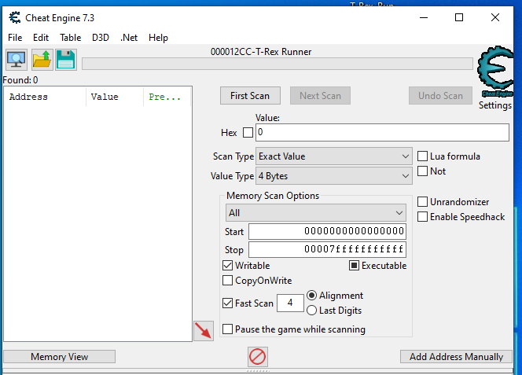
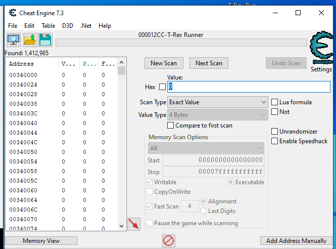

We're given an .exe for a game, based on [Chrome's T-Rex Runner](https://trex-runner.com/). After scoring a point and dying, we're presented with a hint for the flag:


The game gets very difficult very quickly, so we're likely going to need to "hack" our score to be 9999. A quick check of the `file` command reveals that this is a .NET binary, which comes in handy when using [Cheat Engine](https://www.cheatengine.org/). I'll solve this challenge two ways, with and without using Cheat Engine's .NET hooking.

## Cheating with the non-.NET approach
Cheat Engine at it's core is a memory scanning program, allowing us to scan for memory regions of a process and modify it. What we want to do here is find the area in memory where the score is stored and modify it to 9999, hopefully giving us the flag.

With CE, we can utilise the scan feature to scan for values iteratively. We can do an initial scan for 0, gain a point, then scan again for 1. This will find all the memory regions which were originally zero and are now one. We can repeat this process over and over until we're left with one chunk of memory, which we can then modify as we please.

To start off, I'll restart the game and run into the first obstacle I see. I'll then go into CE and open the game process.


We can then do an initial scan for the score of zero.



This gives us roughly 1.4 million results for the number zero. 



Changing all of these values to 9999 will likely crash the program. Therefore, we want to try gain a couple of points, then do another scan for that value. I ended up getting 2 points, then put 2 into the "Value" box and hit Next Scan.


This has reduced the 1.4 million results down to just 2557. We can then do this process again. By our third scan, we're down to just 11 regions of memory which could represent our score. 


By our fourth scan, we're down to a single memory region. Therefore, we have found where are score is stored in the process memory.


We'll now need to change this value to 9999. However, we cannot do this after we have died, as our score is reset once the game resumes again. Therefore, in order to do this, I've set up a hotkey to pause the game (you can find this within Edit > Settings > Hotkeys). I'll restart the game, pause it, change the memory value, then start the game again. Assuming that the program checks whether the score is greater than 9999 when you get a point, we should then see the flag printed.


Unfortunately, pausing the game for too long results in it becoming unresponsive, so you have to be quick when pausing the game. Luckily for us, we don't have to get a point after the score is 9999.


## Cheating in .NET applications
Hidden away in the top bar of Cheat Engine is a .Net entry. If we open the .NET Info of the process, we're provided with a list of libraries present within the binary and the classes within these libraries.


We can see that within the exe, there is a load of randomly named classes (possibly the obfuscation of the flag printing function). A quick scroll through of the other classes reveals that Form1 contains variables for things such as the score, jump speed and position.


From here, we can use CE to scan the entire process for memory regions which match the structure of these variables. This then provides us with the exact memory region for each of these values (this is especially useful in Unity games, as they're generally compiled to .NET).


From here, we can either copy the address into the main CE viewer or just double click on the score value to change it, giving us the flag.

# Part 2
In part 2, we're told that we need to set our y val to greater than 500.


I tried the same approach that I did above, where I used the Lookup instances feature to find the yVal, then change it. However, upon changing it and jumping, it resets the value. This may be because the code looks something like this:

```python
if player.pressesKey("space"):
    player.isJumping = True

jumpingTicks = 0

def onGameTick():
    if player.isJumping:
        jumpingTicks += 1
        player.yVal = jumpingTicks * 5
```

In this case, changing the yVal does not help, as it's dependent on jumpingTicks instead. Commonly, these types of tricks rely on something like this:

```python
def onGameTick():
    if player.isJumping:
        player.yVal = player.yVal + 10
```

As when the instruction adds to yVal, it takes our modified value then adds 10, rather than re-calculating it and setting it.

## Watching opcodes
We can copy the address of the yVal (in this case `0x030e8298`) and click "Add Address Manually" in the main CE window. 


We can then highlight this entry and press F6, which is a shortcut for "Find out what writes to this address". This will attach a debugger to the process. If we then restart the game and play for a little bit, we can see some instructions come up in the dialog box.


Here, we can see the `mov [esi], eax` instruction, indicating that our assumption that the value is being calculated else where, rather than adding to our current yVal is likely correct. We can highlight the instruction and hit "View Disassembly" to view the disassembly of this instruction.


It's not overly helpful, but Cheat Engine has an awesome feature which allows us to override register values for a specific instruction.  If we assume that `[esi]` is our yVal, and `eax` is the new value for the y coordinate, we can set `eax` to be 999 and theoretically, we should then satisify the requirements for the flag.

To do this, we can right click on the instruction in the disassembler and select "Change register at this location".


Once we've done this, we can go back to the game, restart it and jump. Our modified instruction will then be called, and we'll be presented with the flag.

